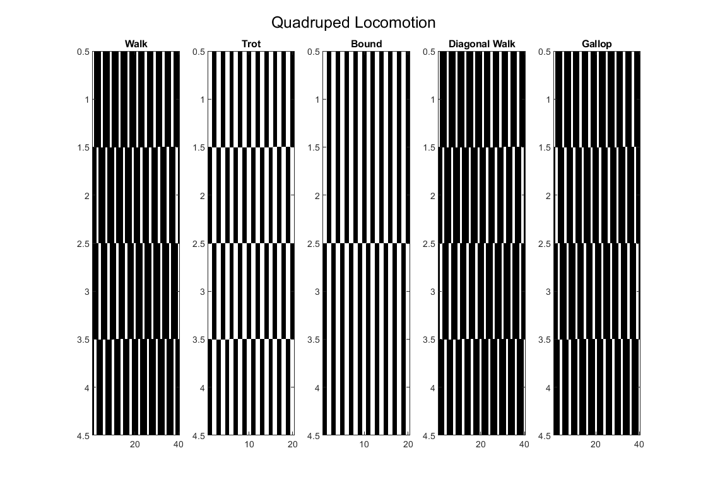

Learning Algorithm
==========================================

Spiking Patterns:
--------------------------------

* Walk: 

| N  |t1 |t2 |t3 |t4 |
|----|---|---|---|---|
| N1 | 1 | 0 | 0 | 0 |
| N2 | 0 | 0 | 1 | 0 |
| N3 | 0 | 0 | 0 | 1 |
| N3 | 0 | 1 | 0 | 0 |
   
* Trot:
N1  1  0
N2  0  1
N3  1  0
N4  0  1
   t1 t2

* Bound:
N1  1  0
N2  1  0
N3  0  1
N4  0  1
   t1 t2
 
* Diagonal Walk:
N1  1  0  0  0
N2  0  0  1  0
N3  0  1  0  0
N4  0  0  0  1
   t1 t2 t3 t4
   
* Gallop: 
N1  1  0  0  0
N2  0  1  0  0
N3  0  0  1  0
N4  0  0  0  1
   t1 t2 t3 t4

Each gait sequence (Walk, Trot, Bound, Diagonal Walk and Gallop) must be repeated more than once during the learning process, otherwise you get a network that cannot stably reproduce gait. So we set a number of repetitions reps = 10.

Remark: 

* Ni = quadruped legs
* ti = time instances

Gaits:

