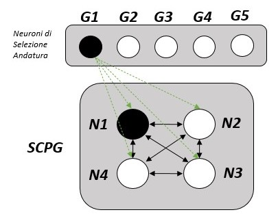

Supervised Learning Algorithm
==========================================

A supervised training algorithm is a type of machine learning algorithm where the model is trained on a labeled dataset. In this type of algorithm, the model is given input-output pairs and the goal is to learn the mapping from inputs to outputs. The model makes predictions based on the input data and then the algorithm compares the predicted output with the actual output (also known as label or ground truth) to calculate the error. This error is then used to update the model parameters so that the prediction error is minimized, allowing the model to improve its accuracy with each iteration. This process continues until the model reaches a satisfactory level of accuracy or a stopping criterion is met.

 The Network Structure of the Central Pattern Generator
 -----------------------------------
 

 
The SCPG network is composed of 4 "spiking" neurons fully connected. Each neuron corresponds to one leg and spikes to activate the servo motor of the corresponding leg. The first goal of this work is to obtain a single CPG capable of reproducing multiple gaits, each of which can be triggered by a different "gait selection neuron" which mimics the action of higher brain area. We use 5 gait selection neurons (G1, G2,...,G5) to enable five different gaits: lateral walk, diagonal walk, gallop, trot and bound. To choose the gait pattern desired, one gait selection neuron stimulates a subset of CPG neurons to fire in a particular sequence and enable a designed locomotion gait. All the CPG neurons are connected to the gait selection neurons with excitatory synapses. To emulate the dynamics of each neuron, we use a discretized leaky integrate and fire (LIF) model with membrane potential (Vj) expressed as:

 

The leaking current is modelled with a decay factor α (α must be > 1 in order to be physically reasonable, we used ```α = 1.1```). When the membrane potential Vj exceeds the spiking threshold Vth, a spike is fired and the membrane potential is instantly reset to the resting potential, which is zero. A pre-synaptic spike, Si,  results in the increment of the membrane potential of the post-synaptic neurons. The synaptic weights (Wij) scale the inputs from the presynaptic neurons (i-th neuron) to the post-synaptic neuron (j-th neuron) as shown in the equation. Therefore, the membrane voltage increase caused by the pre-synaptic spike occurs in the immediate next cycle. 

With that said, the training problem is to program the weight matrices so that when a gait selection neuron fires, the desired sets of CPG neurons fire in the next few time steps to generate the gait pattern. We use a supervised weight update algorithm to program the synaptic weights in the network. To start, all the weights are initialized randomly. In the beginning, the obtained and the required spiking patterns are not identical. The algorithm tries to make the required and
obtained spiking patterns identical. If the obtained and required spike patterns of the SCPG are the same then the neuron is firing correctly, thus the weights need no further modification. To suppress redundant spiking, the incoming weights to that neuron are decreased. This procedure of stochastic updates is
repeated for every gait. At each instant of the sequence, the number of erroneous spikes constitutes the network error. For all gaits, with the random initialization, the error oscillates and finally converges to zero indicating correct programming of the gait pattern in the SCPG. 


Spiking Patterns:
--------------------------------

* Lateral Walk (Camminata Laterale): 

|    |t1 |t2 |t3 |t4 |
|----|---|---|---|---|
| N1 | 1 | 0 | 0 | 0 |
| N2 | 0 | 0 | 1 | 0 |
| N3 | 0 | 0 | 0 | 1 |
| N4 | 0 | 1 | 0 | 0 |

* Diagonal Walk (Camminata Diagonale):

|    |t1 |t2 |t3 |t4 |
|----|---|---|---|---|
| N1 | 1 | 0 | 0 | 0 |
| N2 | 0 | 0 | 1 | 0 |
| N3 | 0 | 1 | 0 | 0 |
| N4 | 0 | 0 | 0 | 1 |
   
* Gallop (Galoppo): 

|    |t1 |t2 |t3 |t4 |
|----|---|---|---|---|
| N1 | 1 | 0 | 0 | 0 |
| N2 | 0 | 1 | 0 | 0 |
| N3 | 0 | 0 | 1 | 0 |
| N4 | 0 | 0 | 0 | 1 |   
   
* Trot (Trotto):

|    |t1 |t2 |
|----|---|---|
| N1 | 1 | 0 | 
| N2 | 0 | 1 | 
| N3 | 1 | 0 |
| N4 | 0 | 1 | 

* Bound (Saltello):

|    |t1 |t2 |
|----|---|---|
| N1 | 1 | 0 | 
| N2 | 1 | 0 | 
| N3 | 0 | 1 |
| N4 | 0 | 1 | 

Each gait sequence (Walk, Trot, Bound, Diagonal Walk and Gallop) must be repeated more than once during the learning process, otherwise you'll get a network that cannot stably reproduce gait. So we set a number of repetitions: ```reps = 10```.

Remark: 

* N_i = Neurons
* t_i = Time Instances


Convergence
-------------------

In this section, we analyze the capacity of the algorithm to store multiple gaits on a single CPG. Due to the stochasticity of the weight adaptation algorithm, not all simulation trials achieve convergence. Also, as the number of gaits increases, the percentage of correct convergences is expected to drop. Thus, we choose a different number of gaits to be programmed and run 100 iterations for each (```n_trials = 100```). Then we identify the number of instances of all gaits being correctly learnt to obtain the percentage of cases where the system convergences correctly. In this case we observed that a maximum of three gaits can be learnt with a high convergence
rate of (> 80%). By adding an additional gait the convergence rate undergoes a drastic reduction to about 20%. Finally, by adding the fifth gait, the result obtained is a convergence rate of 1%. The network is thus able to guarantee the ability to store up to five unique gaits but, the low rate of convergence, makes the optimization algorithm not very "robust" since, only in a few cases, it finds an acceptable configuration of acceptable weights.

The SCPG network with the Wij weights obtained from the learning algorithm, which can generate the five gaits as the control changes, was used in order to implement a robotic controller for the locomotion of the quadruped robot.
