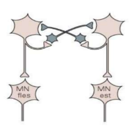

Implementation of a Spiking Neuronal Network for Quadruped Robot Control
================================

CPGs - Central Pattern Generators
--------------------------------

Negli esseri viventi un CPG è una rete di neuroni relativamente piccola in grado di produrre pattern ritmici anche in assenza di feedback sensoriali o di segnali provenienti dal sistema nervoso centrale (SNC). 

Tal reti sono fondamentali per molte funzioni vitali dato che generano i segnali che scandiscono movimenti quali la locomozione, la respirazione, la masticazione ed altre attività ritmiche.

Nei vertebrati, i CPG sono posizionati a livello della spina dorsale ed il controllo dell'attività motoria dipende sia da feedback sensoriali (es. riflessi miotatico/flessorio/ecc...) sia da reti sovraspinali, che, sulla base di una pianificazione solitamente legata a sistemi visivi (es. cambi di ritmo basati sul percorso che si deve compiere) attivano i CPG, determinando l'andatura dell'animale.

Funzione dei CPG: selezione di quali muscoli devono essere attivati (intensità e tempo): pattern di movimento caratterizzati da forze e velocità variabili. 

I segnali esterni modificano, a loro volta, il comportamento dei CPG sulla base di feedback sensoriali e vestibolari, permettendo cambiamenti di andatura e adattamento agli ostacoli. Di conseguenza, il CPG deve essere in grado di modificare la propria dinamica per poter generare andature e velocità diverse.

Sources: 

* Sintesi di Central Pattern Generator in grado di produrre ritmi prestabiliti ([link](https://web.uniroma1.it/et2018/sites/default/files/memorie/Lodi.pdf))
* Central Pattern Generators ([link](https://en.wikipedia.org/wiki/Central_pattern_generator))

Obiettvo: Locomozione Quadrupede (Bioloid Dog)
--------------------------------

Questo è in grado di generare diverse tipologie di andature, in questo caso verranno studiate:

* Camminata (Walk)
* Trotto (Trot)
* Galoppo (Gallop)
* Camminata Diagonale (Diagonal Walk)
* Saltello (Bound)

Si avranno quindi 5 neuroni di selezione andatura (G_i) ognuno dei quali attiverà un diverso pattern in funzione del movimento delle gambe richiesto per tale andamento.

HCO (Half-Center Oscillator)
------------------------------

La generazione del ritmo nelle reti CPG dipende dalle proprietà intrinseche dei neuroni CPG e dalle loro connessioni sinaptiche.

L’unità fondamentale del CPG è la cella, ossia una popolazione di neuroni sincronizzati tra loro.
Un meccanismo è quello dell'Inibizione Reciproca: quando N1 è attivo eccita l'interneurone inibitorio che va ad inibire N2. 

Quindi, attraverso meccanismi ritmici si attivano i neuroni che controllano il motoneurone alfa del muscolo flessore oppure quelli che controllano il motoneurone alfa del muscolo estensore. (Non sono mai attivi contemporaneamente!!!) 
Tali neuroni posssono modulare la propria frequenza in fuznione dei segnali provenienti dal centro superiore.

In questo caso ho due celle reciprocamente inibite: l'HCO si occupa della regolazione dei muscoli flessori ed estensori della singola zampa. Quindi, ogni CPG può essere attivato in modo indipendente.

