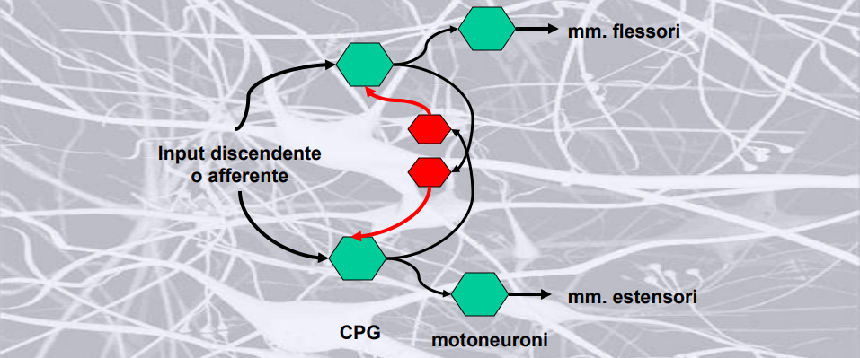

Implementation of a Spiking Neuronal Network for Quadruped Robot Control
================================

CPGs - Central Pattern Generators
--------------------------------

Negli esseri viventi un CPG è una rete di neuroni relativamente piccola in grado di produrre pattern ritmici anche in assenza di feedback sensoriali o di segnali provenienti dal sistema nervoso centrale (SNC). 

Tal reti sono fondamentali per molte funzioni vitali dato che generano i segnali che scandiscono movimenti quali la locomozione, la respirazione, la masticazione ed altre attività ritmiche.

Nei vertebrati, i CPG sono posizionati a livello della spina dorsale ed il controllo dell'attività motoria dipende sia da feedback sensoriali (es. riflessi miotatico/flessorio/ecc...) sia da reti sovraspinali, che, sulla base di una pianificazione solitamente legata a sistemi visivi (es. cambi di ritmo basati sul percorso che si deve compiere) attivano i CPG, determinando l'andatura dell'animale.

Funzione dei CPG: selezione di quali muscoli devono essere attivati (intensità e tempo): pattern di movimento caratterizzati da forze e velocità variabili. 

I segnali esterni modificano, a loro volta, il comportamento dei CPG sulla base di feedback sensoriali e vestibolari, permettendo cambiamenti di andatura e adattamento agli ostacoli. Di conseguenza, il CPG deve essere in grado di modificare la propria dinamica per poter generare andature e velocità diverse.

Obiettvo: Locomozione Quadrupede (Bioloid Dog)
--------------------------------

Questo è in grado di generare diverse tipologie di andature, in questo caso verranno studiate:

* Camminata (Walk)
* Trotto (Trot)
* Galoppo (Gallop)
* Camminata Diagonale (Diagonal Walk)
* Saltello (Bound)

Si avranno quindi 5 neuroni di selezione andatura (G_i) ognuno dei quali attiverà un diverso pattern in funzione del movimento delle gambe richiesto per tale andamento.

HCO (Half-Center Oscillator)
------------------------------

La generazione del ritmo nelle reti CPG dipende dalle proprietà intrinseche dei neuroni CPG e dalle loro connessioni sinaptiche.

I circuiti che generano questa attività ritmica alternata sono stati evidenziati principalmente a livello del midollo spinale e si basano su dei circuiti a semicentro (half-center). Il ruolo dei neuroni inibitori (rossi) in figura è quello di produrre un’inibizione reciproca: ovvero, quando N1 è attivo eccita l’interneurone inibitorio che va ad inibire quello antagonista N2. Quindi, attraverso dei meccanismi ritmici, sono attivi i neuroni che controllano il motoneurone alfa del muscolo flessore oppure quelli che controllano il motoneurone alfa del muscolo estensore. (Non sono mai attivi contemporaneamente!!!) 

Una cosa importante è che i motoneuroni che generano questa attività possono modulare la loro frequenza in funzione ai segnali che provengono dal centro superiore. Normalmente questi circuiti generano un’attività ritmica basale (associata ad una certa frequenza di attività). Per aumentare o diminuire tale frequenza è necessario che un segnale proveniente dai centri superiori vada a stimolare questi circuiti. Quindi questi circuiti da soli non possono modificare l’attività ritmica locomotoria, per poter modulare tale attività è necessario un segnale che provenga dai centri superiori.

In questo caso ho due neuroni reciprocamente inibiti: l'HCO si occupa della regolazione dei muscoli flessori ed estensori della singola zampa. Quindi, ogni CPG può essere attivato in modo indipendente.

Sources
-------------------------------

* Baruzzi V, Lodi M, Storace M, Shilnikov A. Towards more biologically plausible central-pattern-generator models. Phys Rev E. 2021 Dec;104(6-1):064405. doi: 10.1103/PhysRevE.104.064405. PMID: 35030894.
* A. Lele, Y. Fang, J. Ting and A. Raychowdhury, "An End-to-End Spiking Neural Network Platform for Edge Robotics: From Event-Cameras to Central Pattern Generation," in IEEE Transactions on Cognitive and Developmental Systems, vol. 14, no. 3, pp. 1092-1103, Sept. 2022, doi: 10.1109/TCDS.2021.3097675.
* Barasuol, Victor & De Negri, Victor & De Pieri, Edson. (2011). WCPG: A Central Pattern Generator for Legged Robots Based on Workspace Intentions. ASME 2011 Dynamic Systems and Control Conference and Bath/ASME Symposium on Fluid Power and Motion Control, DSCC 2011. 2. 10.1115/DSCC2011-6164. 
* V. Barasuol, J. Buchli, C. Semini, M. Frigerio, E. R. De Pieri and D. G. Caldwell, "A reactive controller framework for quadrupedal locomotion on challenging terrain," 2013 IEEE International Conference on Robotics and Automation, 2013, pp. 2554-2561, doi: 10.1109/ICRA.2013.6630926.

