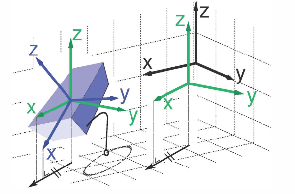
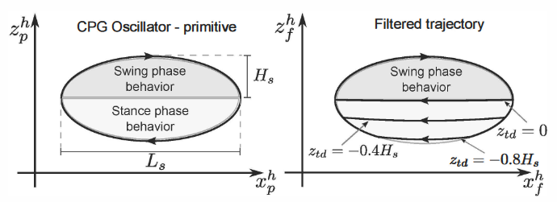
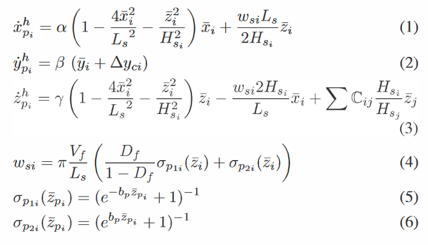
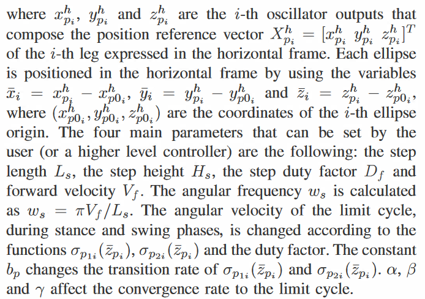

[Webots](https://www.cyberbotics.com/#cyberbotics) Version: R2021a

---------------------------------------------------------

Goals:

* Avoid trajectories that would penetrate the ground (avoid high ground reaction forces - GRF);
* Avoid weak contact or loss of contact (avoid slippage);
* Avoid undesired leg internal forces (avoid slippage and waste of energy);
* Reduce disturbances between joint position and trunk attitude controllers;
* Reduce disturbances at the trunk due to poor state estimation (avoid excessive GRF);
* Increase the locomotion robustness with respect to unexpected terrain irregularities (avoid excessive GRF).

Horizontal Frames
-----------------

An important element of our framework is the horizontal frame which is a reference frame whose xy plane is always horizontal such that the projection of its x axis on the horizontal plane is parallel to the same projection of the x axis of the robot (that is, the horizontal frame has the same yaw angle as the robot, with respect to the world frame). 

In this picture we can see teh horizontal reference frames (in green) and the robot frame (in blue - the parallelepiped represents the robot trunk); horizontal frames share the same yaw angle with respect to the world reference frame (in black).

Choosing such a horizontal frame as the coordinate frame for motion generation and control provides several advantages. In general, it makes the trajectory generation of the CPG block independent from the trunk attitude, therefore the influence of the trunk attitude controller on the feet trajectories is minimized. This feature is very important for improved locomotion stability and for push recovery.

Motion Generation
-------------------

The purpose of this part of the framework is to generate stereotypic and reactive motions for the feet. We will use a CPG-inspired trajectory generator that provides elliptical trajectories for the feet, which dynamically adapt to the terrain profile.

Ellipse-shaped trajectories are generated by a network of four non-linear oscillators, whose state represents the Cartesian coordinates of each foot. We add non-linear filters coupled to the output of the network of oscillators. During each leg's swing phase the filter output tracks the output of its corresponding oscillator. The filters also receive information about the foot contact on the ground, allowing them to adapt the trajectories according to the actual terrain profile. This is achieved by cutting the ellipses, as explained later. The shape of the adapted trajectories are illustrated in the following image on the right.

Here we can see the foot trajectory generated by the CPG oscillator (on the left) and the trajectory modulated by the non linear filter (on the right). Ls and Hs are respectively the length and the height of a single step; Ztd is the filter parameter which determines where the original elliptic trajectory has to be interrupted (to start the stance phase). The h on the axes labels stands for horizontal frame.

The equations governing the network of oscillator inspired by the CPG are the following:

Remark: The last term in (3) is the coupling term that allows independent modulation of each step height without disturbing the synchronization. The gait pattern is selected according to the coupling matrix C. --> We will not use this term!!

The output filter is written as

(7) and (8) are responsible for switching the behaviour of the limit cycle between swing and stance phases according to the touchdown position. The higher the value of the constants bp and bf, the faster the transitions between swing and stance phase behaviours. 

The step depth parameter Ztd affects the reshaping of the trajectory by determining at which height the ellipse has to be interrupted. If a terrain map is available the swing to stance transition can be planned in advance, reducing the impact forces. In absence of a map (i.e. the robot is walking blindly), the feet trajectories can be dynamically adjusted as soon as touchdown is detected; this feature makes the locomotion more robust also with respect to poor state estimation. During the execution of the trajectory, the foot touchdown event is recognized; Ztd is consequently adjusted to match the actual step height/depth and the filter changes the shape of the trajectory.

Bibliography
------------

+ V. Barasuol, J. Buchli, C. Semini, M. Frigerio, E. R. De Pieri and D. G. Caldwell, "A reactive controller framework for quadrupedal locomotion on challenging terrain," 2013 IEEE International Conference on Robotics and Automation, 2013, pp. 2554-2561, doi: 10.1109/ICRA.2013.6630926.
+ Barasuol, Victor & De Negri, Victor & De Pieri, Edson. (2011). WCPG: A Central Pattern Generator for Legged Robots Based on Workspace Intentions. ASME 2011 Dynamic Systems and Control Conference and Bath/ASME Symposium on Fluid Power and Motion Control, DSCC 2011. 2. 10.1115/DSCC2011-6164. 
